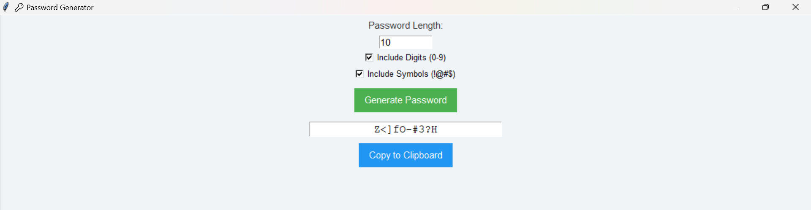

# Password Generator (GUI)

A simple Python **GUI app** (Tkinter) that generates strong random passwords.

---

## Features
- Adjustable length
- Option to include/exclude digits
- Option to include/exclude symbols
- Copy password to clipboard with one click
- Clean & colorful Tkinter interface

---

## Preview
Here’s how the app looks:

<p align="center">
  <br>
</p>

---

## Usage

1. Clone repo
```bash
git clone https://github.com/ramizdevelops/password-generator.git
cd password-generator-gui
```

2. Run the GUI
```bash
python password_generator_gui.py
```

---

## Tech Stack

Python 3  
Tkinter (built-in, no installation needed)

---

## License

This project is licensed under the [MIT License](LICENSE)